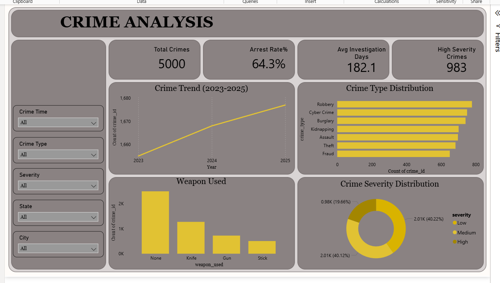
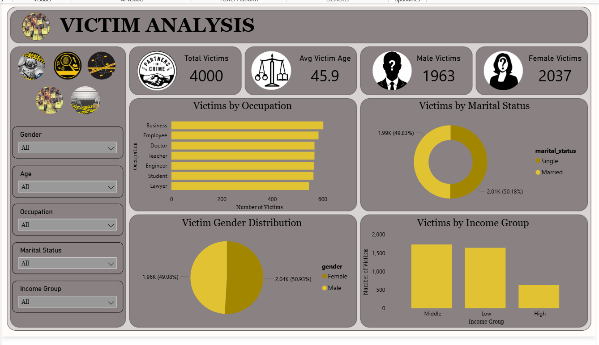
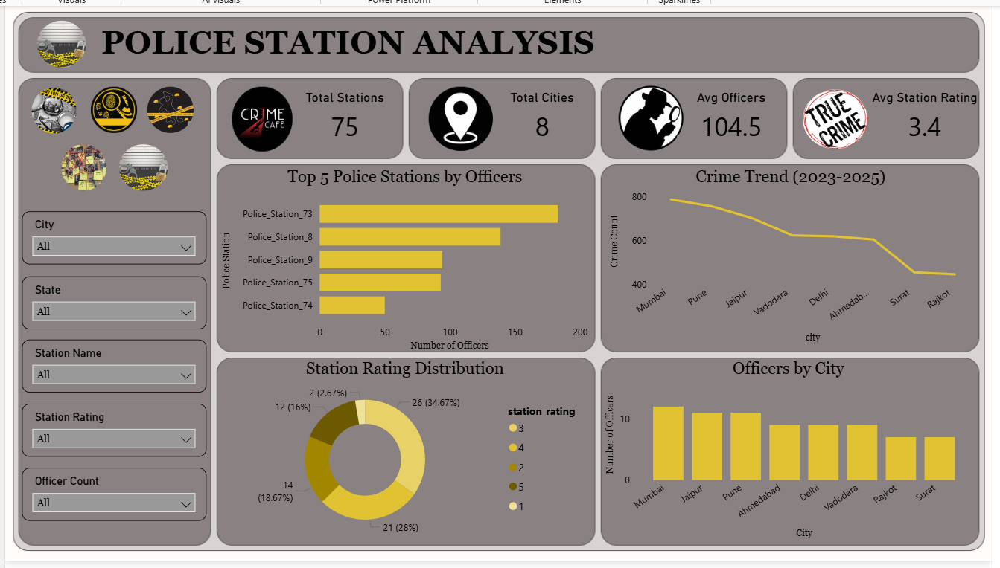
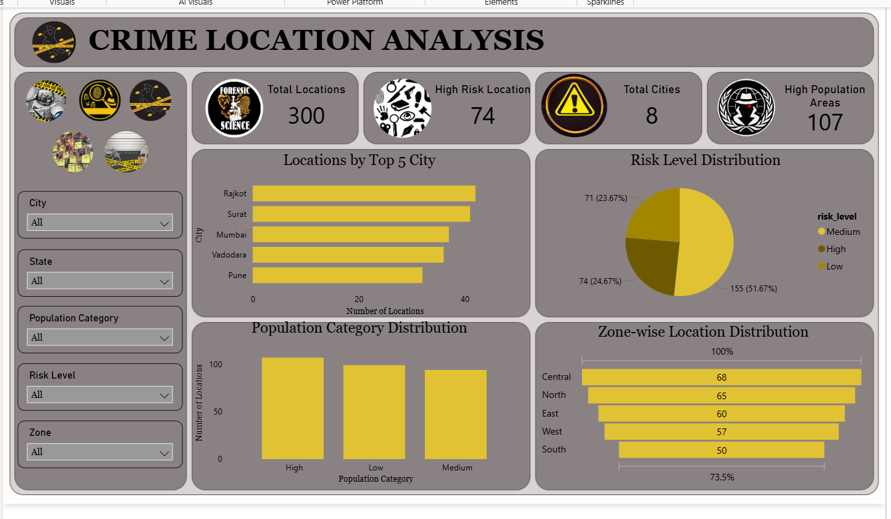
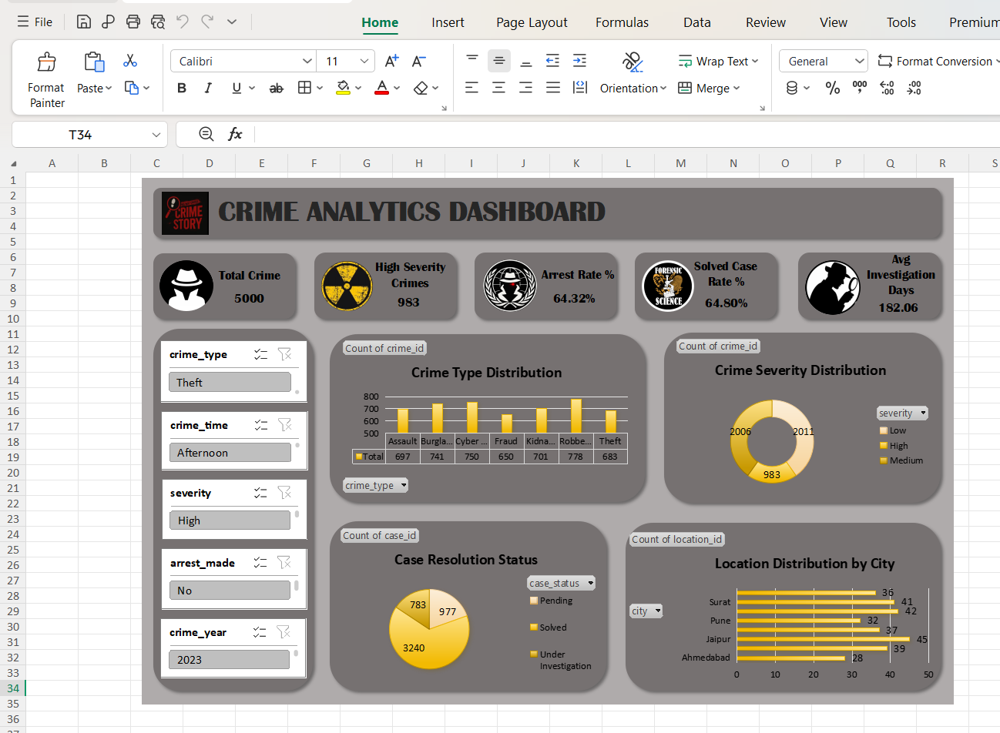

# 🚔 Crime Analytics Dashboard

<p align="center">
  
</p>

<p align="center">


</p>

An end-to-end Data Analytics project that analyzes crime records using Excel, SQL, Python, and Power BI to generate meaningful insights through interactive dashboards.

---

## 📌 Project Overview

This project demonstrates the complete Data Analytics workflow, starting from raw datasets and ending with interactive Power BI dashboards.

The project focuses on crime data analysis to identify trends, crime patterns, investigation performance, victim statistics, police station performance, and geographical insights.

The complete analysis was performed using multiple analytical tools including Microsoft Excel, DBeaver (SQL), Python (NumPy, Pandas, Matplotlib, Seaborn), and Power BI.

---

## 🎯 Project Objectives

- Analyze crime trends across different years.
- Identify high-severity crimes.
- Evaluate arrest and solved case rates.
- Analyze victim demographics.
- Study police station performance.
- Explore geographical crime distribution.
- Build interactive dashboards for decision-making.

---

## 🛠 Tech Stack

- Microsoft Excel
- SQL (DBeaver)
- Python
- NumPy
- Pandas
- Matplotlib
- Seaborn
- Power BI

## 📂 Project Structure

```
Crime-Analytics-Dashboard
│
├── Dataset/
│   ├── Cases.csv
│   ├── Crimes.csv
│   ├── Locations.csv
│   ├── Police_Stations.csv
│   └── Victims.csv
│
├── Excel/
│   ├── Crime_Analytics_Project.xlsx
│   └── Crime_Analytics_Final.xlsx
│
├── SQL/
│   └── Crime_Analytics_SQL_Queries.sql
│
├── Python/
│   └── Crime_Analysis.ipynb
│
├── Power BI/
│   └── Crime_Analytics.pbix
│
├── Images/
│
└── README.md
```

## 📊 Dashboard Preview

### Crime Analysis


---

### Victim Analysis



---

### Police Station Analysis



---

### Crime Location Analysis



---

### Excel Dashboard

